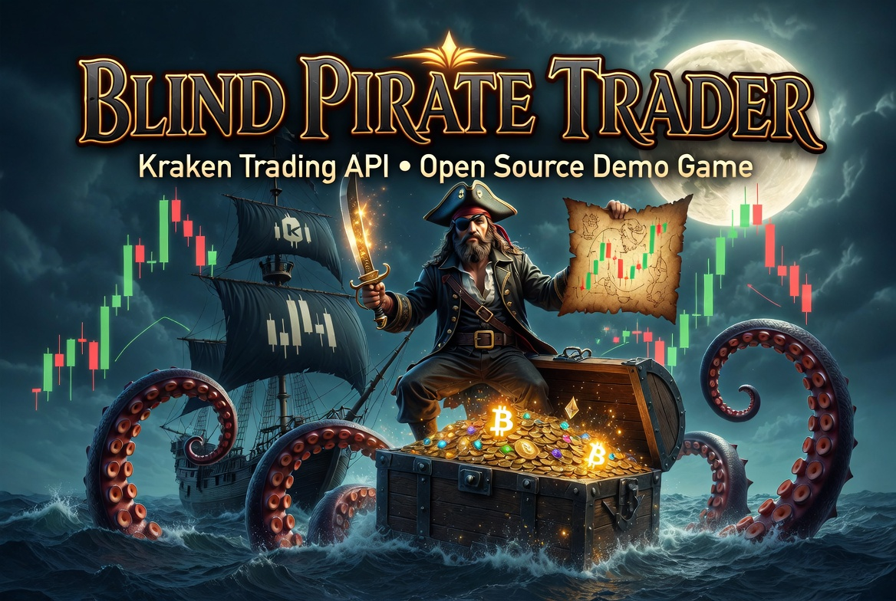

# Blind Pirate Trader



## Trading simulator game on real Kraken assets, using the Kraken API

Trade one of Kraken's top crypto/USD pairs over a real historical window — but you won't know which, or when. Price is normalized around **$100**.

- Start with $10,000 cash.
- Buy or sell in $100 / $500 / $1000 lots.
- Each trade advances the simulator by 1 minute.
- Fast-forward 5m → 1d to skip ahead.
- End any time, or play to the end of the series.
- The asset is revealed at the end with full P&L.

## Live demo

[dandv.github.io/blind-pirate-trader](https://dandv.github.io/blind-pirate-trader)

## Development

```bash
deno install
deno task dev
```

Then navigate to http://localhost:8080.

## Kraken API usage

The game was developed as a preliminary exploration of Kraken's API suitability for consumption by AI agents.

Price data is collected via Kraken Spot APIs and persisted into VictoriaMetrics (see [ticks](ticks/README.md)):

- Live: WebSocket `ticker` (bid/ask sizes) + `trade` (last/lastSize), labeled `source=ws`
- Historical: REST `/Trades` paginated raw-trade backfill (`source=trades`); game builds 5s OHLCV in VicMet

The data ingestion pipeline collects the top 20 traded /USD spot pairs by 24h volume, dynamically discovered at startup via Kraken public REST /Ticker + /AssetPairs. Pairs were ranked by approximate notional volume (24h base volume * last price) among online /USD pairs that have leverage enabled and are not stablecoin bases (USDT, USDC, etc.).

To re-run collection locally:

```bash
# Point VICMET_URL in .env at your ingest instance, then:
deno task ticks          # live WS
deno task ticks:trades   # 1-month raw-trade backfill from REST Trades
```

## API feedback

✅ Time-to-first-call was well within 10 minutes, the bottleneck being the agent speed.  
❌ The WebSocket API uses different asset pair labels (e.g. XBT vs. BTC). This is [documented](https://support.kraken.com/articles/360000920306-api-symbols-and-tickers), but there is room for improvement:

- 💡 the `wsname` mapping could be prominnetly highlighted so even less capable agents can easily identify it
- 🐛 the [AssetPairs REST endpoint](https://docs.kraken.com/api-reference/market-data/get-tradable-asset-pairs) incorrectly returns the wsname for XDGUSD as "XDG/USD", which fails for WS - `{"error":"Currency pair not supported XDG/USD","method":"subscribe","success":false,"symbol":"XDG/USD"}`. As a workaround, this was hardcoded in the game as `DOGE` instead of `XDG`.
- 🐛 https://support.kraken.com/articles/advanced-api-faq has a broken link to the [REST API Trades endpoint](https://docs.kraken.com/rest/#operation/getRecentTrades). It should be https://docs.kraken.com/api-reference/market-data/get-recent-trades#get-recent-trades.
